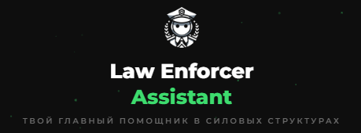
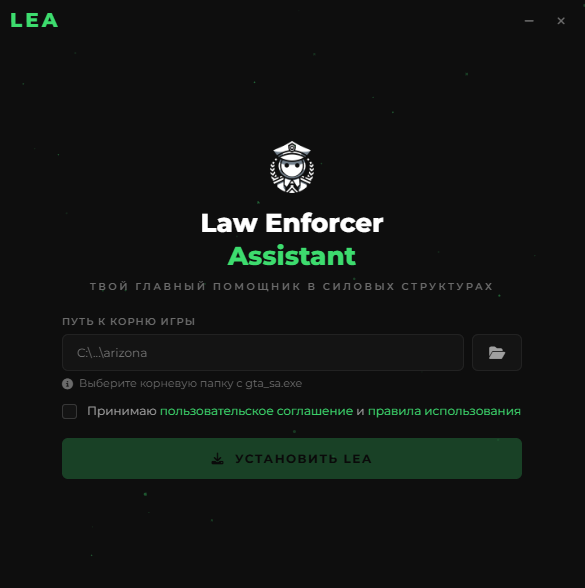
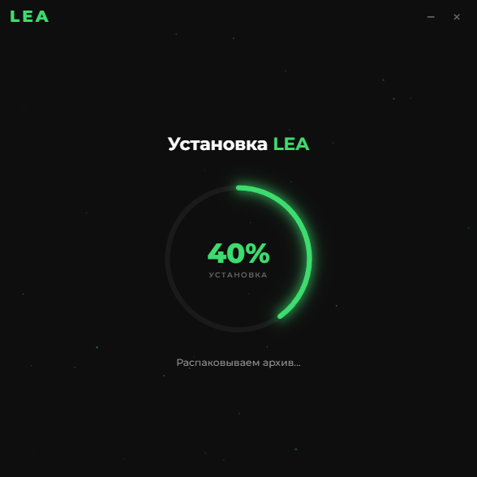
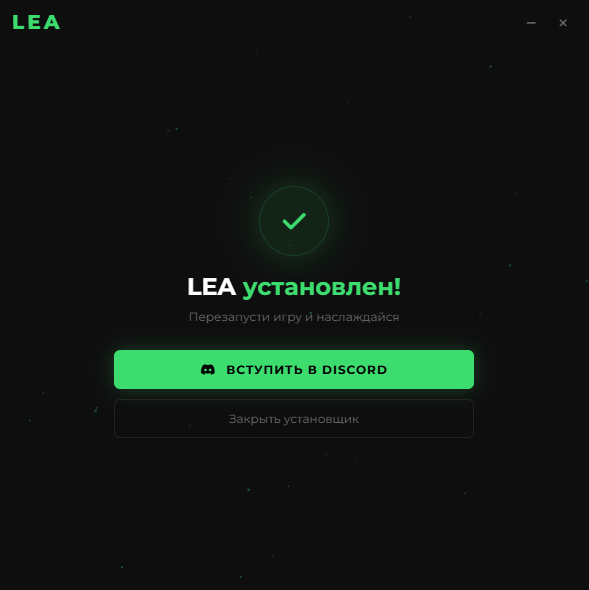

# LEA Installer

<p align="center">
  
</p>

<p align="center">
  <b>Modern Windows installer for Law Enforcer Assistant (LEA)</b><br/>
  Built with Tauri (Rust backend + Vanilla JS frontend)
</p>

<p align="center">
  
  
  
  
</p>

---

## ✨ Overview

**LEA Installer** is a modern Windows desktop installer built with **Tauri**.

It automatically:

- ✅ Validates GTA San Andreas installation path  
- ✅ Detects running `gta_sa.exe` process  
- ✅ Forces game shutdown if needed  
- ✅ Downloads installation archive with live progress  
- ✅ Extracts files with real-time PowerShell progress tracking  
- ✅ Installs LEA manager  
- ✅ Cleans temporary files  
- ✅ Displays smooth animated UI with circular progress  

This project demonstrates:

- Rust async programming  
- Tauri event-based architecture  
- Streaming downloads with progress  
- Windows process management  
- PowerShell integration  
- Clean frontend ↔ backend communication  

---

# 🎥 Preview

## Main Screen



## Installation Progress



## Completed



---

# 🧠 Architecture

This project follows a **clean Frontend ↔ Backend separation** using Tauri commands and events.

---

## 🔹 Frontend (HTML / CSS / JS)

Responsible for:

- UI rendering  
- Canvas particle background animation  
- Circular SVG progress animation  
- User input validation  
- Screen state transitions  
- Listening for backend progress events  

Communication:

```js
window.__TAURI__.core.invoke("command_name", payload)
window.__TAURI__.event.listen("install-progress", callback)
```

---

## 🔹 Backend (Rust + Tauri)

Responsible for:

- Folder selection dialog  
- Path validation (`gta_sa.exe` check)  
- Checking running processes (`tasklist`)  
- Killing process (`taskkill`)  
- Downloading files (Reqwest + streaming)  
- Extracting archive (PowerShell with progress pipe)  
- Emitting progress events  
- Elevating privileges in release mode  

---

## 🔄 Installation Flow

```text
User selects game folder
        ↓
validate_path()
        ↓
check_game_running()
        ↓
(optional) kill_game()
        ↓
start_installation()
        ↓
download_file_with_progress()
        ↓
extract_with_powershell_progress()
        ↓
emit_progress() events
        ↓
Frontend updates circular UI
```

---

# 🦀 Backend Highlights (Rust)

## ✅ Streaming download with progress

- Uses `reqwest`
- Uses `bytes_stream()`
- Calculates global percentage ranges (0–40%, 80–98%, etc.)
- Emits events via:

```rust
window.emit("install-progress", ProgressPayload { ... })
```

---

## ✅ PowerShell extraction with live progress

Archive extraction runs in a blocking thread:

```rust
tokio::task::spawn_blocking(...)
```

PowerShell prints:

```text
PROGRESS:45
```

Rust reads stdout line-by-line and converts it into UI progress events.

---

## ✅ Windows process handling

```rust
tasklist /FI "IMAGENAME eq gta_sa.exe"
taskkill /F /IM gta_sa.exe
```

Hidden window mode:

```rust
.creation_flags(CREATE_NO_WINDOW)
```

---

## ✅ Auto-elevation (release only)

- Checks admin rights using `net session`
- Relaunches with `ShellExecuteW(..., "runas")`
- Hides console window

---

# 🎨 UI Features

- Modern dark UI  
- SVG circular animated progress  
- Smooth percent interpolation  
- Animated particle background (Canvas)  
- Screen transitions  
- Tauri window controls (minimize/close)  

---

# 🛠 Tech Stack

| Layer      | Technology |
|------------|------------|
| Backend    | Rust |
| Framework  | Tauri 2 |
| Async      | Tokio |
| HTTP       | Reqwest |
| Extraction | PowerShell |
| Frontend   | HTML + CSS + Vanilla JS |
| Animation  | Canvas + SVG |

---

# 📂 Project Structure

```text
.
├── ui/
│   ├── index.html
│   ├── styles.css
│   └── script.js
│
└── src-tauri/
    ├── src/
    │   └── main.rs
    ├── Cargo.toml
    └── tauri.conf.json
```

---

# ⚙️ Development

Install dependencies:

```bash
npm install
```

Run in development mode:

```bash
npm run tauri dev
```

or

```bash
cargo tauri dev
```

---

# 🏗 Build Release

```bash
npm run tauri build
```

or

```bash
cargo tauri build
```

Executable will be located at:

```text
src-tauri/target/release/
```

---

# 🔐 Security & Permissions

In release mode:

- App checks for administrator privileges  
- Automatically relaunches with elevation  
- Runs without console window  
- Uses temporary directory for downloads  
- Verifies downloaded file is not empty  

---

# 💡 Why Tauri?

- Native performance (Rust backend)  
- Small binary size  
- Secure IPC model  
- Full Windows API access  
- Modern UI stack  

---

# 📜 License

This project is licensed under the MIT License.

---

# 👤 Author

Built as a portfolio project showcasing:

- Rust async systems  
- Desktop architecture  
- Windows internals integration  
- Frontend ↔ backend communication design  

---

<p align="center">
  <b>LEA — Your main assistant in law enforcement structures.</b>
</p>
